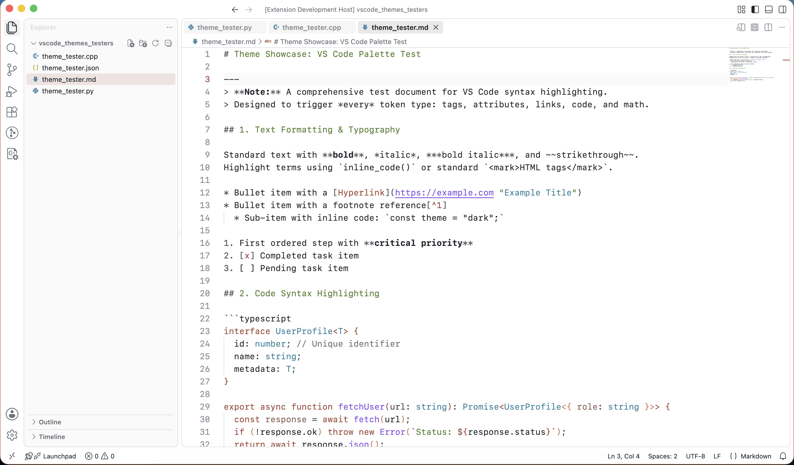
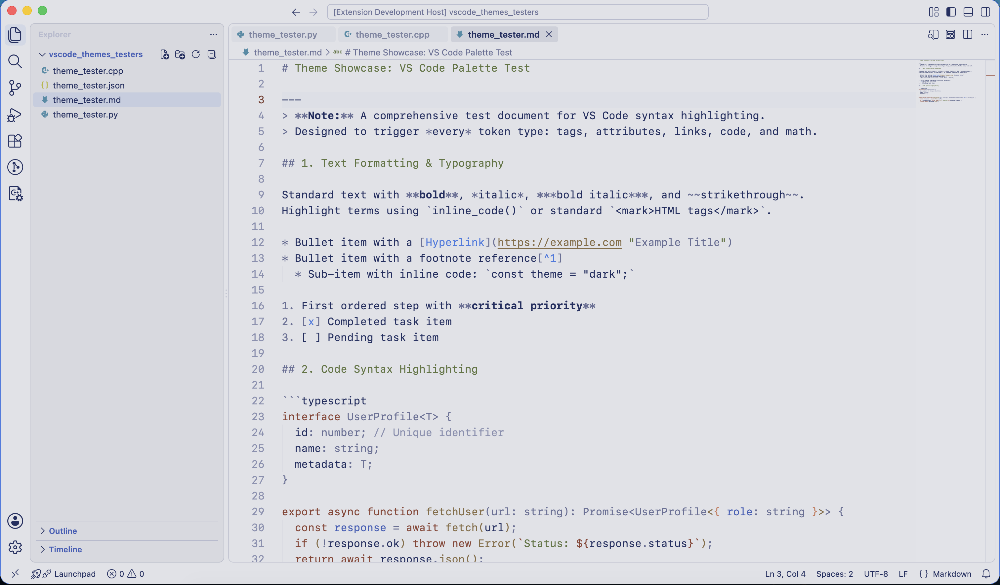
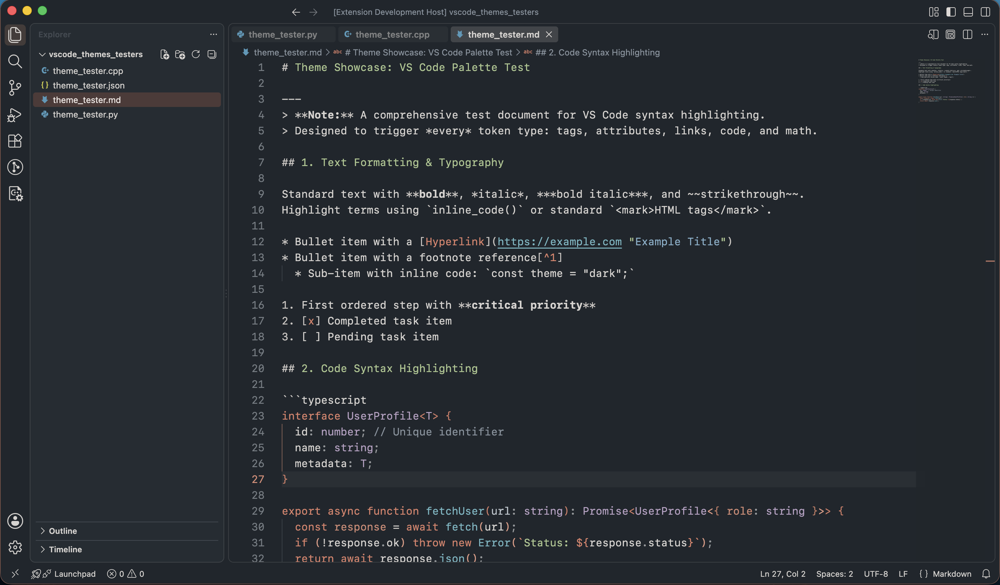

# Hypnotic Copper

**Hypnotic Copper** is a family of carefully crafted Visual Studio Code themes with Metal, Glow, and Dark variants shaped by readable contrast and warm copper accents.

Rather than relying on highly saturated rainbow syntax highlighting, Hypnotic Copper emphasizes readability through restrained color usage, semantic highlighting, and a cohesive palette. The result is a calm editing experience designed for long coding sessions.

## Why Hypnotic Copper?

Hypnotic Copper started as an attempt to make copper accents feel useful rather than decorative. The themes share the same basic vocabulary across three surfaces: blue-gray metal, crisp white, and graphite dark. Metal keeps a cool machined feel, Glow keeps the editor and terminal bright, and Dark keeps the contrast comfortable in lower light.

The goal is modest: keep the workspace calm, make syntax and semantic colors easy to scan, and let terminal tools preserve their own signal colors. Copper is used as an accent for focus, selection, and identity rather than as a blanket tint.

It is still a theme in motion, learning its own balance as the three variants settle into their roles. That is part of the point: each release tries to make the palette a little clearer, calmer, and more useful.

## Themes

### Hypnotic Copper Metal

A cool metallic theme inspired by machined aluminum and softly tinted blue-gray interfaces.

* Soft blue-gray editor and workbench surfaces
* Deep navy primary text with clear secondary foregrounds
* Warm copper accents for keywords, active UI elements, and modified resources
* Copper-accented list, input, scrollbar, and status-bar interactions
* Blue focus and information colors that remain distinct from copper emphasis
* Calm, balanced syntax highlighting with readable contrast
* Designed for bright environments without the harshness of traditional light themes

### Hypnotic Copper Glow

A crisp white light theme with the contrast language of Hypnotic Copper Dark.

* White editor and terminal surfaces
* Off-white workbench structure for subtle separation
* Copper accents based on `#9E4C3B`, `#CC7C5E`, and `#D97757`
* Selectively darkened foregrounds for light-background readability
* Targeted Python and C++ token refinements
* Palette-tuned terminal ANSI colors with distinct command-line signals

### Hypnotic Copper Dark

A charcoal and graphite variant that preserves the same visual identity.

* Deep graphite editor and workbench
* Warm copper highlights throughout the interface
* Palette-tuned terminal ANSI colors for build tools and shell output
* Carefully balanced syntax colors for excellent readability
* Comfortable for extended coding sessions

## Design Philosophy

Hypnotic Copper follows a few simple principles:

* Readability comes before decoration.
* Color should communicate meaning rather than compete for attention.
* Copper is reserved for emphasis instead of being used everywhere.
* Comments remain subtle.
* No italics.
* No forced bold styling for programming-language syntax.
* Semantic highlighting is used where supported to provide richer information without increasing visual noise.
* UI elements should feel cohesive rather than visually fragmented.

The syntax palette intentionally remains restrained:

* **Copper** — keywords, decorators, Bazel keyword arguments, HTML tags
* **Callable accents** — functions, methods, and Bazel rule names, tuned per variant
* **Sage** — strings
* **Plum** — types and classes
* **Blue Steel** — namespaces and readonly symbols
* **Bronze** — numbers and enum members
* **Graphite** — punctuation and operators
* **Silver** — variables
* **Gray** — comments

## Features

* ✓ Metal, Glow, and Dark variants
* ✓ Semantic highlighting
* ✓ Carefully tuned workbench colors
* ✓ Broad coverage for Chat, inline editing, diff and merge views, notebooks, testing, settings, and SCM graphs
* ✓ Refined GitLens integration
* ✓ Improved hover widgets
* ✓ Copper-inspired bracket pair highlighting
* ✓ Copper-aware status bar, remote indicator, and compact-item hover states
* ✓ Palette-tuned terminal ANSI styling with distinct warning and error colors
* ✓ Consistent theme color keys across variants
* ✓ Targeted Python, C++, Starlark, and Bazel token refinements
* ✓ Dark terminal and editor tooltips
* ✓ Consistent Source Control and Activity Bar styling
* ✓ No italics
* ✓ No forced bold styling for programming-language syntax

## Compatibility

Hypnotic Copper requires Visual Studio Code 1.125.0 or newer.

## Installation

1. Open the **Extensions** view in Visual Studio Code.
2. Search for **Hypnotic Copper**.
3. Install the extension.
4. Open **Preferences → Color Theme**.
5. Choose one of the following:

   * **Hypnotic Copper Metal**
   * **Hypnotic Copper Glow**
   * **Hypnotic Copper Dark**

## Screenshots

Each variant is shown with Python, C++, and Markdown examples.

### Hypnotic Copper Glow

**Python**

**C++**

**Markdown**

### Hypnotic Copper Metal

**Python**

**C++**

**Markdown**

### Hypnotic Copper Dark

**Python**

**C++**

**Markdown**

## Feedback

Suggestions, bug reports, and pull requests are welcome.

If you find inconsistencies between languages, semantic highlighting, or editor UI elements, please open an issue. Hypnotic Copper is continuously refined with readability as the primary goal.

## License

MIT
